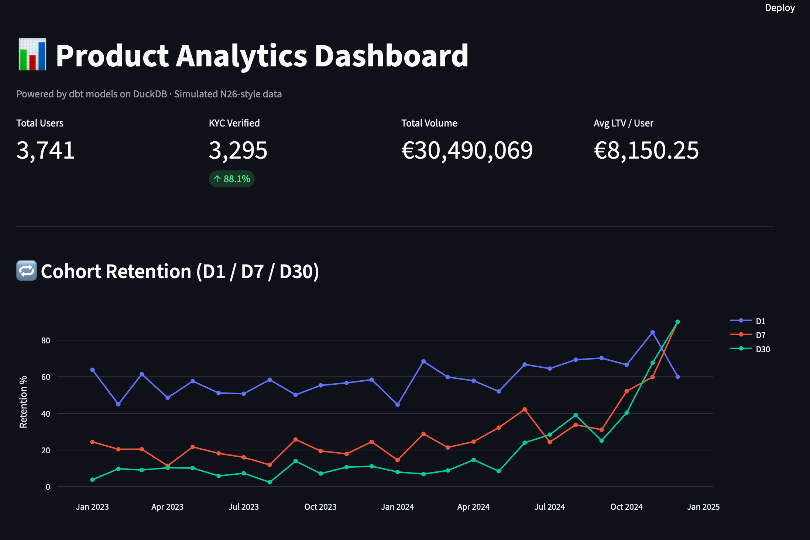
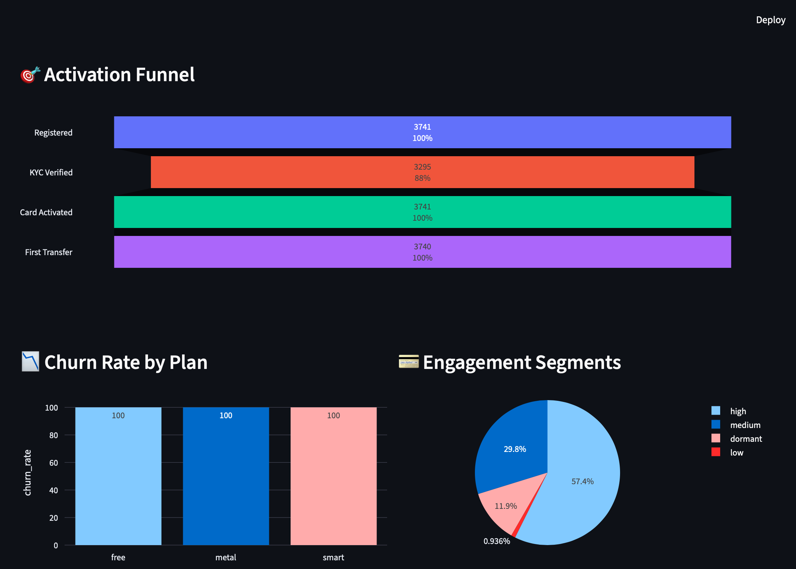
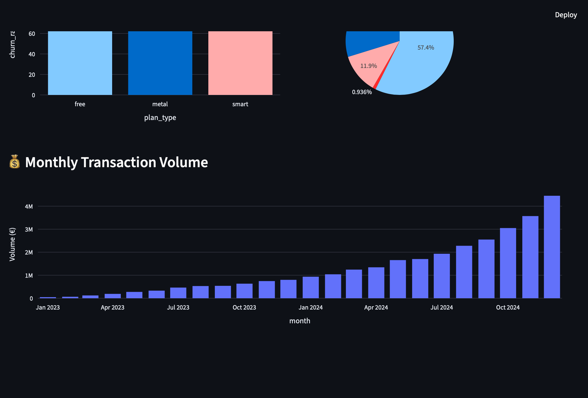

# 🏦 Banking Analytics Pipeline

End-to-end analytics engineering project simulating a neobank data stack (N26-style).
Covers the full lifecycle: raw data → dbt transformations → tests → BI dashboard → CI/CD.

> Built as a portfolio project demonstrating analytics engineering skills relevant to fintech companies like N26, Revolut, and Monzo. Each layer of the pipeline mirrors how data engineering operates in production: Raw Data → Staging → Transformations → Marts → BI Dashboard → CI/CD.

---

## Dashboard Screenshots

---

## Architecture

\`\`\`
Raw CSVs (simulated)
      │
      ▼
DuckDB (local DWH)          ← designed for Redshift in production
      │
      ▼
dbt Core
  ├── staging/              (views: rename, cast, clean)
  ├── intermediate/         (ephemeral: business logic)
  └── marts/
      ├── finance/          (fct_transactions)
      ├── product/          (dim_users, fct_retention, fct_churn)
      └── marketing/        (fct_activation_funnel)
      │
      ▼
Streamlit Dashboard         ← internal analytics tool
      │
      ▼
GitHub Actions CI/CD        ← automated dbt run + test on every push
\`\`\`

---

## Tech Stack

| Layer | Tool | Production Equivalent |
|---|---|---|
| Data Warehouse | DuckDB | AWS Redshift |
| Transformations | dbt Core | dbt Cloud |
| Orchestration | GitHub Actions | Airflow |
| BI / Dashboards | Streamlit + Plotly | Metabase / Tableau |
| Containerization | Docker | ECS / Kubernetes |
| CI/CD | GitHub Actions | GitHub Actions |

---

## Key Metrics Modelled

- **D1 / D7 / D30 Cohort Retention** — by signup month, country, plan type
- **Activation Funnel** — Registration → KYC → Card Activation → First Transfer
- **Monthly Churn Rate** — by plan type and country
- **User Engagement Segments** — dormant / low / medium / high
- **ARPU & LTV** — average revenue and lifetime value per user
- **Monthly Transaction Volume** — completed transaction volume over time

---

## Key Concepts Demonstrated

- **dbt best practices** — staging → intermediate → marts layer separation, tests, documentation, CI/CD
- **Data quality** — unique, not_null, accepted_values, relationships tests on all models
- **Analytics Engineering** — clean data models enabling stakeholder self-service
- **Software engineering practices** — version control, CI/CD, modular code
- **BI tooling** — interactive dashboard with filters, KPI cards, funnel, cohort analysis
- **Synthetic data generation** — realistic neobank data with proper distributions

---

## Dataset

**5,000 users** · **~125,000 transactions** · **~90,000 app events** · **~5,800 cards**

Simulated over 2 years (2023–2024) with realistic distributions:

| Dimension | Distribution |
|---|---|
| Plan type | 65% free / 25% smart / 10% metal |
| KYC verification rate | 88% |
| Countries | DE (40%), AT (12%), ES (12%), FR (10%), others |
| Transaction types | 60% payment / 30% transfer / 10% ATM |
| Transaction status | 92% completed / 5% failed / 3% pending |

---

## Project Structure

\`\`\`
banking-analytics-pipeline/
├── .github/workflows/
│   └── dbt_ci.yml                  # CI: generate → load → dbt run → dbt test
├── data/
│   ├── app_events.csv              # generated locally (not committed)
│   ├── cards.csv
│   ├── transactions.csv
│   └── users.csv
├── dbt/
│   ├── models/
│   │   ├── staging/                # stg_users, stg_transactions, stg_app_events, stg_cards
│   │   ├── intermediate/           # int_user_activity, int_onboarding_funnel
│   │   └── marts/
│   │       ├── finance/            # fct_transactions
│   │       ├── product/            # dim_users, fct_retention, fct_churn
│   │       └── marketing/          # fct_activation_funnel
│   ├── dbt_project.yml
│   └── profiles.yml
├── scripts/
│   ├── generate_data.py            # synthetic data generator
│   └── load_to_duckdb.py           # loads CSVs into DuckDB raw schema
├── streamlit_app/
│   └── app.py                      # interactive analytics dashboard
├── streamlit_screenshots/          # dashboard screenshots
├── docker-compose.yml
├── Dockerfile.pipeline
└── requirements.txt
\`\`\`

---

## Setup

### Prerequisites

- Python 3.11+
- Git

### Quickstart

\`\`\`bash
# 1. Clone the repository
git clone https://github.com/YOUR_USERNAME/banking-analytics-pipeline
cd banking-analytics-pipeline

# 2. Create and activate virtual environment
python -m venv venv
source venv/bin/activate        # Mac/Linux
venv\Scripts\activate           # Windows

# 3. Install dependencies
pip install -r requirements.txt

# 4. Generate synthetic data
python scripts/generate_data.py

# 5. Load data into DuckDB
python scripts/load_to_duckdb.py

# 6. Run dbt models and tests
cd dbt
dbt run --profiles-dir .
dbt test --profiles-dir .
cd ..

# 7. Launch dashboard
python -m streamlit run streamlit_app/app.py
# Open http://localhost:8501
\`\`\`

### Docker (optional)

\`\`\`bash
docker-compose up
# Dashboard available at http://localhost:8501
\`\`\`

---

## License

This project is open-source and available under the **MIT License**. Feel free to use, modify, and distribute this work.

Built as a portfolio project demonstrating end-to-end analytics engineering skills. Inspired by real-world data challenges at fintech companies like N26, Revolut, Monzo, and similar European neobanks.
